# Scientific Research Management System

## 📚 Overview

The Scientific Research Management System is a full-stack web application developed to streamline the workflow of managing scientific research activities within a university environment. The system was designed for multiple user roles — including students, lecturers, and department administrators — to manage and track research topics, assignments, approvals, and reports in one centralized platform.

---

## ✔️ Features

### 👨‍🎓 User-side (Student & Lecturer)

- View completed and approved research topics.
- Search topics by name and view detailed information.
- Display faculties with their associated students, lecturers, and research topics.
- View detailed profiles for faculties, students, lecturers, and topics.
- Show student groups and their assigned supervisors.
- Register/Login for students.
- Students can register topics and upload research files (PDF, Word).
- Students and lecturers can update personal information.

### 🛡️ Admin-side

- Dashboard overview of system metrics (active users, topics, faculties, etc.).
- Role-based login and access control.
- Full CRUD operations for research topics.
- Assign lecturers to specific research topics.
- Manage student and lecturer accounts.
- Add, update, or remove faculty records.

---

## 🛠️ Technologies Used

- **Frontend**: ReactJS, Bootstrap
- **Backend**: ASP.NET Core, Entity Framework Core
- **Database**: SQL Server
- **Other**: RESTful API, Redis (caching)

---

## 📊 System Highlights

- Role-based access: Student / Lecturer / Admin.
- Clean RESTful APIs and layered architecture.
- Statistical reporting by department and semester.
- 200+ topics and 120+ users supported in testing phase.

---

## 📂 Demo Screenshot

### 👨‍🎓 User Page (Student & Lecturer)

🔸 Home Page <br/>
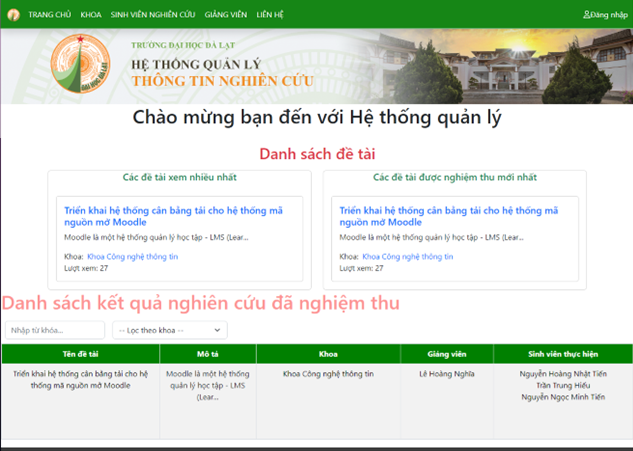 <br/>

🔸 Research Topics List Page <br/>
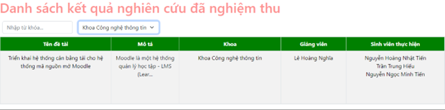 <br/>

🔸 Research Topics Detail <br/>
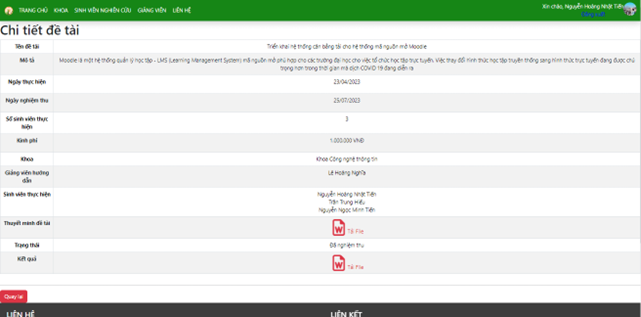 <br/>

🔸 Faculties List Page <br/>
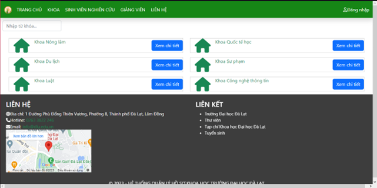 <br/>

🔸 Faculty Detail <br/>
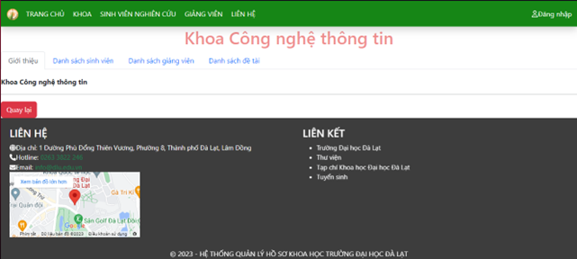 <br/>
 <br/>
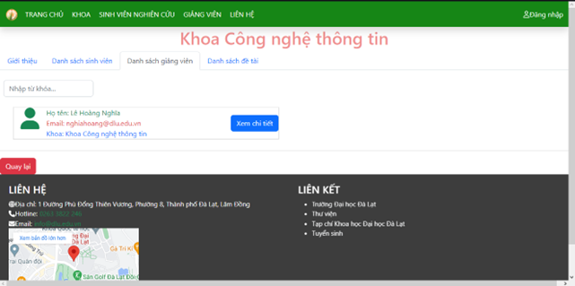 <br/>
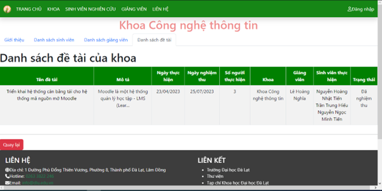 <br/>

🔸 Students List Page <br/>
 <br/>

🔸 Student Detail <br/>
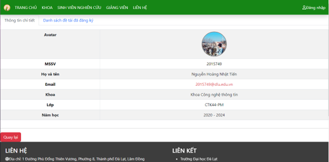 <br/>
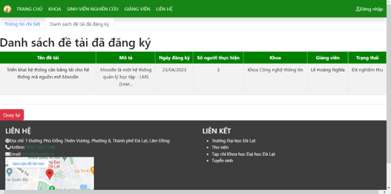 <br/>

🔸 Lecturers List Page <br/>
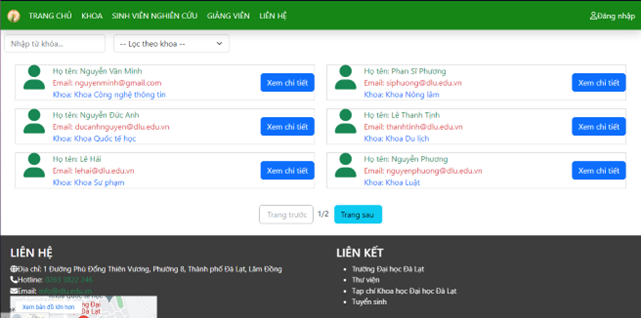 <br/>

🔸 Lecturer Detail <br/>
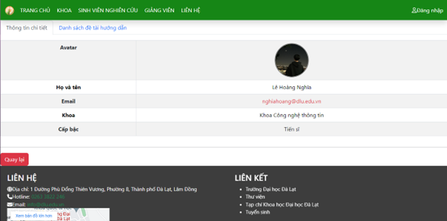 <br/>
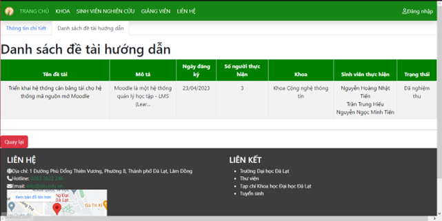 <br/>

🔸 Admin Contact <br/>
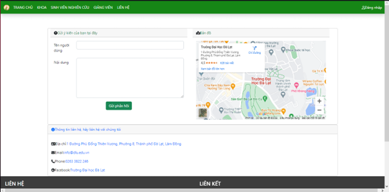 <br/>

🔸 Login & Register <br/>
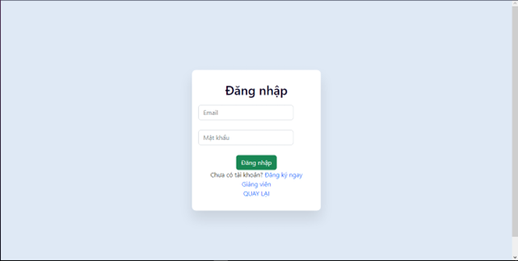 <br/>
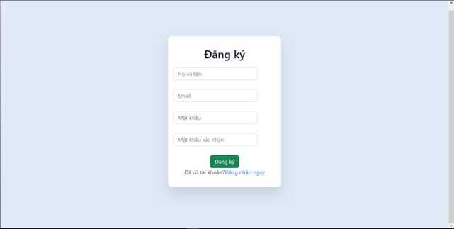 <br/>
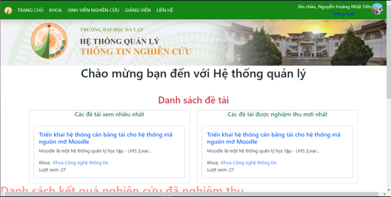 <br/>

### 👨‍🎓 Student Profile Page

🔸 Student Profile <br/>
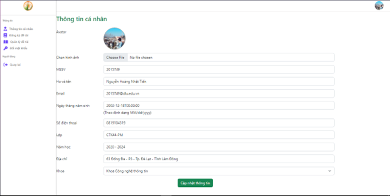 <br/>

🔸 Student Register Topic <br/>
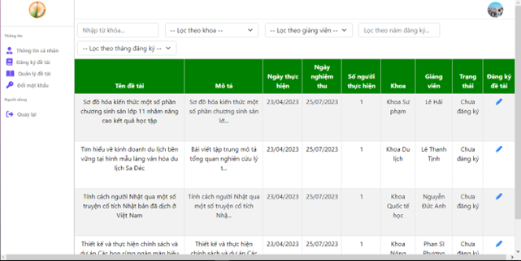 <br/>

🔸 Student Manage Topic <br/>
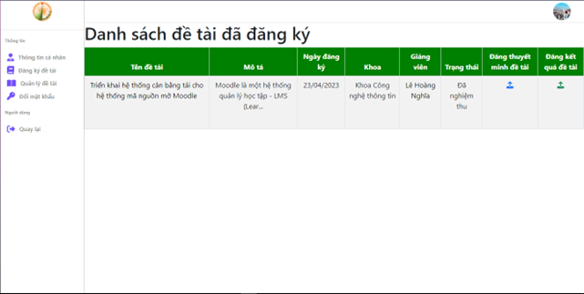 <br/>
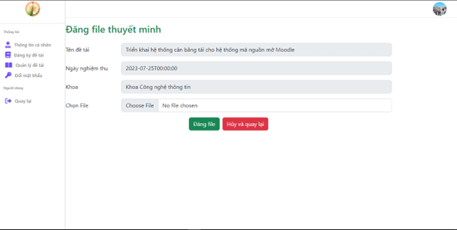 <br/>
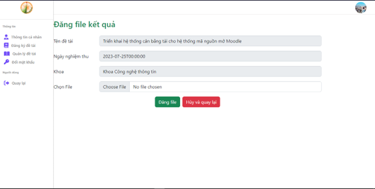 <br/>

🔸 Student Change Password <br/>
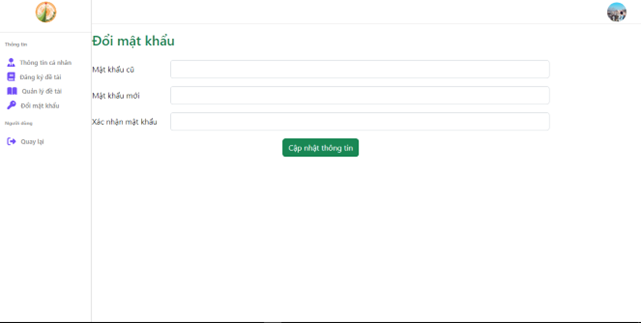 <br/>

### 🛡️ Admin Page

🔸 Login <br/>
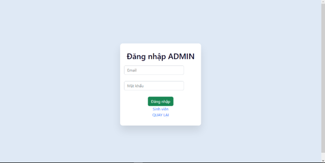 <br/>

🔸 Dashboard <br/>
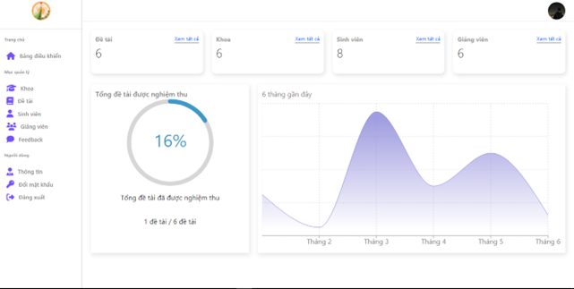 <br/>

🔸 Manage Faculities <br/>
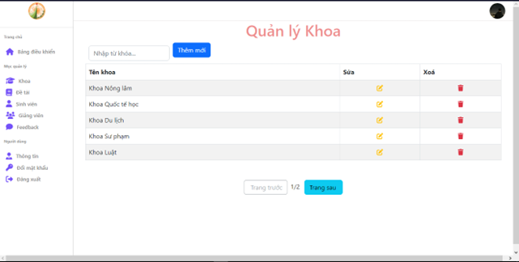 <br/>
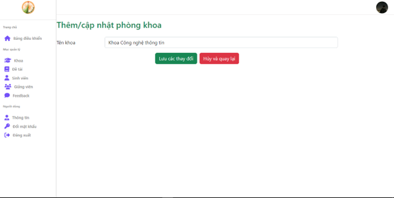 <br/>

🔸 Manage Topics <br/>
 <br/>
 <br/>

🔸 Manage Students <br/>
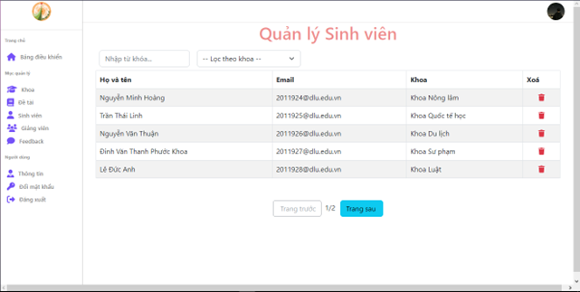 <br/>

🔸 Manage Lecturers
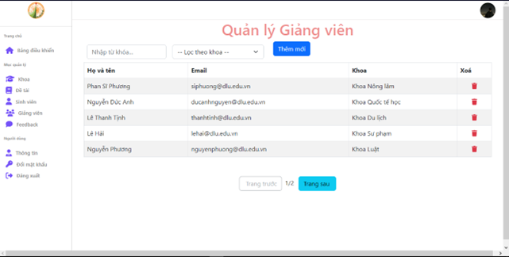 <br/>
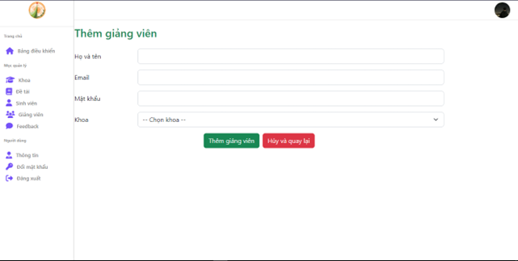 <br/>

🔸 Manage Feedbacks <br/>
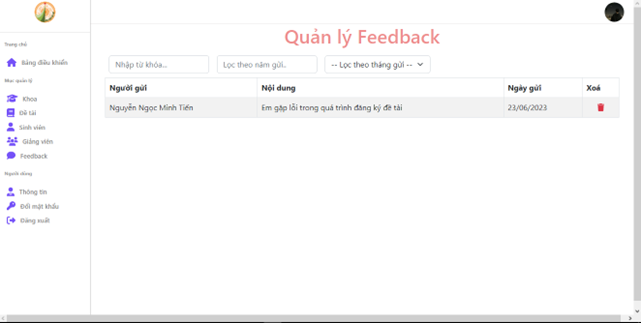 <br/>

🔸 Manage Profile <br/>
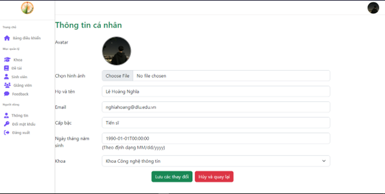 <br/>
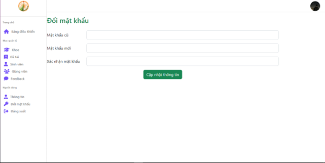 <br/>

---

## 🚀 Getting Started

### 🧰 Prerequisites

Make sure the following tools are installed on your machine:

- [Visual Studio 2022](https://visualstudio.microsoft.com/)
- [Visual Studio Code](https://code.visualstudio.com/)
- [SQL Server](https://www.microsoft.com/en-us/sql-server)
- [Node.js](https://nodejs.org/)
- [Yarn](https://classic.yarnpkg.com/lang/en/docs/install/)

### ⚙️ Backend Setup (.NET Web API)

1. Navigate to the project folder:  
   `src/back-end/Server`

2. Open `Server.sln` using **Visual Studio 2022**.

3. In the Solution Explorer:

   - Right-click on `WebApi`
   - Select **"Set as Startup Project"**

4. Press `F5` or click the green ▶️ button (with **https**) to run the project.

5. The API Swagger UI should appear in your browser.

### 🌐 Frontend Setup (ReactJS)

1. Open a terminal in:  
   `src/front-end/client`

2. Run the following command to install dependencies:

   ```bash
   yarn install
   ```

   > After installation, the `node_modules` folder will be created.

3. Start the React client:

   ```bash
   yarn start
   ```

4. The app will be served at [http://localhost:3000](http://localhost:3000)

---

## 📄 Authors

- [@TienNguyen002](https://github.com/TienNguyen002)
- This project is part of a university course and is intended for educational use only.
